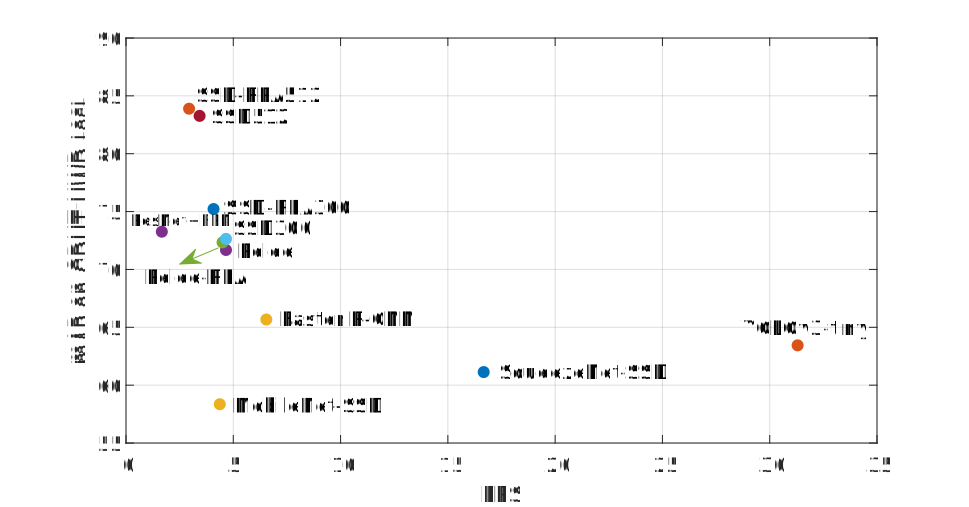
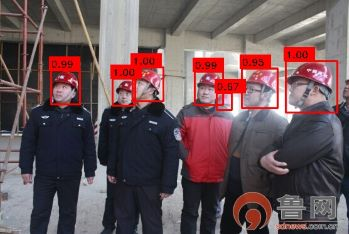
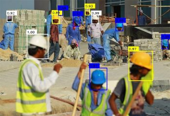
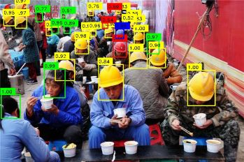
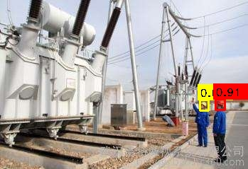
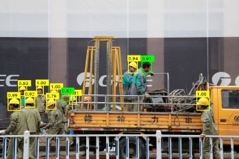

# Automatic Hardhat Wearing Detection

Detecting hardhat-use and identifying the corresponding colors of a hardhat on construction sites based on SSD framework.

## Introduction

This work tries to automate the monitoring of whether people are wearing hardhat on the construction sites and identify the corresponding colors.  Currently,  on the proposed dataset of GDUT-Hardhat Wearing Detection (GDUT-HWD), the SSD model combined with our reverse progressive attention (SSD-RPA) achieves  83.89% mAP with the input size 512×512. In addition, we have released models that are suitable for mobile devices.

## Preparation

1. Install dependencies the Caffe framework needs. You can visit the [caffe official website](http://caffe.berkeleyvision.org/installation.html) and follow the instructions there to install the dependent libraries and drivers correctly.

2. Clone the SSD-RPA repository and compile the code.

   ```shell
   git clone https://github.com/wujixiu/helmet-detection.git
   
   cd helmet-detection/hardhat-wearing-detection/SSD-RPA/
   
   make all -j8
   ```

3. following the instructions in SSD (https://github.com/weiliu89/caffe/tree/ssd) to prepare data.

## Train a model (on Linux)

Suppose the code is running under the SSD-RPA directory and data is prepared.

1. Download [VGG_ILSVRC_16_layers_fc_reduced](https://pan.baidu.com/s/1qkj5TaR33FuaUtaIOuhMWA) or [peleenet](https://pan.baidu.com/s/1AXSvPpwClTMGKwKRFT9Tlg) and put them in models directory.
2. Run the training scripts.

```shell
sh examples/Hardhat/SSD300/train_SSD300.sh
```

## Deploy a pre-trained model 

All models are based on Caffe.

- Environments
  - Windows 10
  - Visual Studio 2013 (Release x64)
  - CPU
  - OpenCV

- C++

  It is highly recommended to use [mini-caffe](https://github.com/luoyetx/mini-caffe) to deploy model for its portability, or OpenCV3 with SSD's layer is enough if you do not use our proposed models with RPA module.  Code with OpenCV3 deployment is available in [old version](https://github.com/wujixiu/helmet-detection/old-version). For mini-caffe deployment under Windows, we provide the complied files in mini-caffe-Release, or you can compile the mini-caffe yourself.  

Notable that different models have different input size and different input scale. Details are shown below.

|     Models     | Input size |          mean          | input scale |
| :------------: | :--------: | :--------------------: | :---------: |
| SqueezeNet-SSD |  300×300   |     (104,117,123)      |    0.017    |
| MobileNet-SSD  |  300×300   |  (127.5,127.5,127.5)   |  0.007843   |
|     Pelee      |  304×304   | (103.94,116.78,123.68) |    0.017    |
|   Pelee-RPA    |  304×304   | (103.94,116.78,123.68) |    0.017    |
|   SSD-RPA300   |  300×300   |     (104,117,123)      |      1      |
|   SSD-RPA512   |  512×512   |     (104,117,123)      |      1      |


## Released data and models

- Dataset Statistics
  - The number of images of GDUT-HWD is 3,174, which has been split into 1,587 for training (GDUT-HWD trainval) and 1,587 for testing (GDUT-HWD test). It contains 18,893 instances falling into 5 classes and each instance is annotated with a class label andits bounding box.
  - Number of instances.

| Label                        | trainval | test | total |
| :--------------------------- | :------: | :--: | :---: |
| blue                         |   1251   | 1361 | 2612  |
| white                        |   1813   | 1968 | 3781  |
| yellow                       |   1936   | 1962 | 3898  |
| red                          |   2148   | 2083 | 4231  |
| none                         |   2171   | 2200 | 4371  |
| small (area ≤ 32×32)         |   4237   | 4713 | 8950  |
| medium (32×32＜area ≤ 96×96) |   4098   | 3826 | 7924  |
| large (area ＞ 96×96)        |   984    | 1035 | 2019  |

- Data is available on [Baidu Yun (646.6MB)](https://pan.baidu.com/s/1_Jj56B05YpUv5iLB9JMb4g) (pwd:dstk).

- The following pretrained models are available.

  - [SqueezeNet-SSD(13.9MB)](https://pan.baidu.com/s/1a-ypwwkMpLO0jFtyepWEcw)
  - [MobileNet-SSD(22.6MB)](https://pan.baidu.com/s/1_bmNMwOi1MZf3bTfJRIhXQ)
  - [YOLOv3-tiny(34.7MB)](https://pan.baidu.com/s/1aWTnRsXMfzBQPK0w-piGPw)
  - [Pelee(22.5MB)](https://pan.baidu.com/s/15-YJAWIRTupFZnOXHwZfQA)
  - [Pelee-RPA(36.4MB)](https://pan.baidu.com/s/114AyAtf4YOaK6GFu6sLFJw)
  - [SSD-RPA300(162.6MB)](https://pan.baidu.com/s/1_igFVMLOiMfR-5QvVn6O3A)
  - [SSD-RPA512(158.9MB)](https://pan.baidu.com/s/1QZ0OJzaYlfpeRMM6pXDVgw)

**Data and weights are available in [Google Drive](https://drive.google.com/drive/folders/12WtXQyM-7jWvWPtCXZlnycsIK72ClHgu?usp=sharing)**

- Speed and accuracy distribution

  The speeds are measured on a single Quadro M2000M 4GB GPU 😅.

  

## Examples











